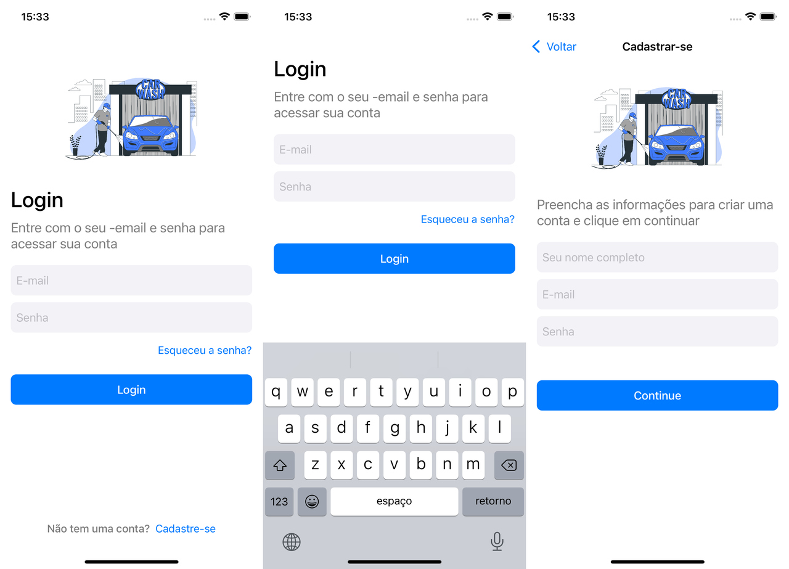

# AppTopCar
Colocando em pratica tudo que está sendo passado no programa go!dev by Idwall

Imagem da aplicação

Até no momento foi desenvolido o fluxo de login/home, login/signUp e login/Forgot\
O projeto consiste em: Login, Cadastre-se, Home e Recuperar senha

## Tecnologias utilizadas
* Switf
* UIKit
* View code
* Xcode 13.2.1

## Bibliotecas instaladas via pod
* Firebase
    * Authenticate
    * Firestore
* TransitionButton

## O que será implementado
- [x] Validação de do campus
- [x] Autenticação com o firebase
    - [x] Login, Cadastro e recuperar
- [x] Salvar dados como nome do usuário no firestore
* Cadastrar imagem para o perfil do usuário
* Editar perfil

